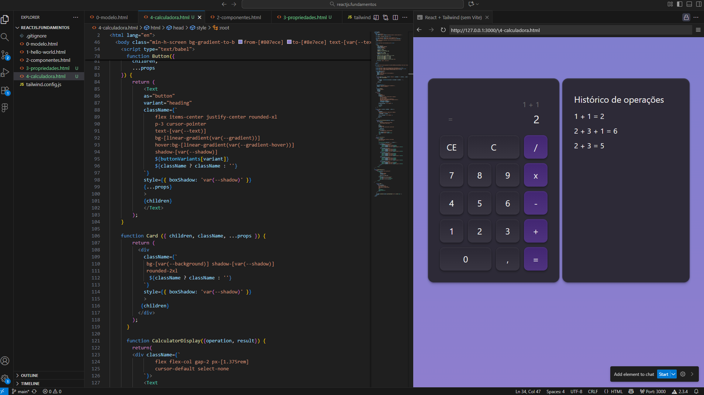
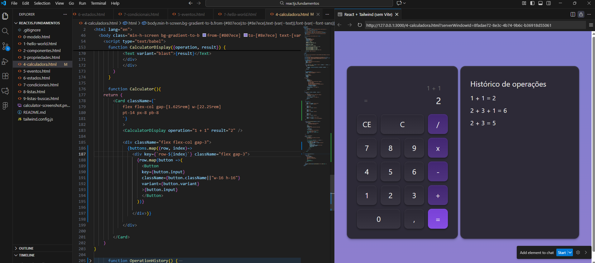

# React Calculator Project

This project marks our first steps with React. We started by setting up the environment in VS Code and creating a simple Hello World application using `ReactDOM.createRoot` and JSX, integrating HTML and JavaScript seamlessly.

In the next stage, we focused on component structure, building reusable elements like cards and buttons. While there’s no interactivity yet, the foundation is ready. Think of componentization as building with Lego blocks—modular and flexible. The next module will introduce React state to make the layout dynamic.

---

In this lesson, we put theoretical concepts into practice by building a dynamic calculator. We created a structured list of buttons, organized in rows where each row is an array of objects representing individual buttons. Using the `map` method, we rendered both the rows and the buttons dynamically, eliminating repetitive code. The final result is a more interactive, clean, and scalable calculator that demonstrates the importance of dynamic rendering in modern front-end development.

---

